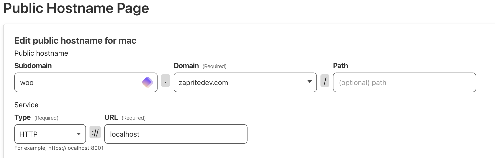
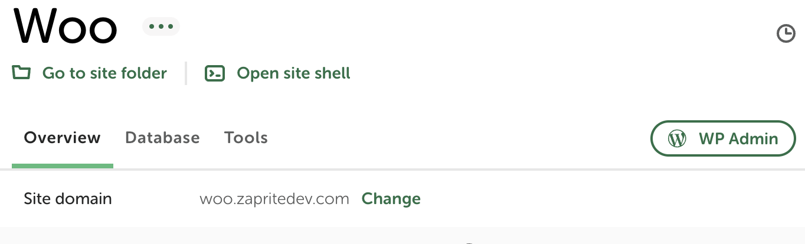

# Zaprite Payment Gateway for WooCommerce

**Accept Bitcoin and Lightning**

Start accepting Bitcoin, Lightning and Liquid today — Powered by Zaprite.

This plugin allows stores that use WordPress WooCommerce shopping cart system to
accept Bitcoin, Lightning, Liquid and card payments using their Zaprite
Checkouts.

_In order to use this plugin you have to create an account on
[https://app.zaprite.com](https://app.zaprite.com)_

## Installation

1. Upload the zipped `zaprite-payment-gateway` folder to the
   `/wp-content/plugins/` directory (or in Plugins > Add New > Upload).
2. Activate the plugin through the 'Plugins' menu in WordPress.
3. Go to WooCommerce > Settings > Payments.
4. Click on 'Zaprite' to configure the payment gateway settings.

## Local development

### With Docker

To develop locally, you can run WordPress locally with docker. This will run
WordPress on port 8000 with debugging enabled. It will also mount your local
`./zaprite-payment-gateway` directly in the WordPress `plugins` directory so
that you can edit and see the result of your changes directly in WordPress.

First, you'll need to run the docker containers:

```
cd wordpress-docker
docker-compose up -d
```

Then you'll need to:

1. Make sure you have [`zaprite-v2`](https://github.com/ZapriteApp/zaprite-v2)
   project running on http://localhost:3000
1. `open http://localhost:8000`
1. Follow the WordPress installation instructions
1. Install and configure the WooCommerce plugin:
   http://localhost:8000/wp-admin/plugin-install.php?s=woocommerce&tab=search&type=term
1. Add a product in woo commerce so that you can test payments
1. Activate Zaprite plugin: http://localhost:8000/wp-admin/plugins.php
1. Configure zaprite plugin:
   http://localhost:8000/wp-admin/admin.php?page=wc-settings&tab=checkout&section=zaprite
    1. Check "Enable payments via Zaprite Checkout"
    1. Enter your Zaprite API key

You can now test the plugin by creating an order in your shop:
http://localhost:8000/shop/

### Without Docker

If you prefer using another way to run WordPress locally, like
[Local by Flywheel](https://localwp.com/), you can clone this git repo anywhere
you want then just create a symlink to the `plugin` directory:

```
ln -s <path to the cloned repo>/zaprite-for-woocommerce/plugin <path to local wordpress>/wp-content/plugins/zaprite-payment-gateway
```

Next you need to set an environment variable to point to your local instance of Zaprite. You can set this at the web server level in Flywheel Locals.
If your instance of Wordpress uses nginx you can "Go to site folder" then open `conf/nginx/site.conf.hbs`. Add this in the `location ~ \.php$` config:

```
fastcgi_param ZAPRITE_APP_URL 'http://localhost:3000';
```

To turn on debugging, open the `wp-config.php`. Add

```
define('WP_DEBUG', true);
```

Lastly, restart your site. This should create a
debug.log file in `wp-content`

### Tunnel
The Zaprite app uses a service called qstash to callback to WooCommerce when an order status is changed. This is because some WooCommerce sites take over 15 seconds to respond (causing load and long timeouts for our server) . To test this locally you need to expose your local Woo site to the public internet so qstash can call back to it. One way to do this is to use Cloudflare tunnel + Flywheel Locals nginx config.

1. Configure Cloudflare Tunnel
   - Create an account https://developers.cloudflare.com/cloudflare-one/connections/connect-networks/get-started/create-remote-tunnel/  
   - You will install the Cloudflare tunnel locally on your machine. You can use brew to install if you are on mac.
   - Next you will need to "Connect an application". Goto your cloud flare tunnel dashboard to configure. Set the service to http://localhost and choose a subdomain name (you will need to purchase a domain name from cloudflare if you don't already have one).
   

2. Configure Flywheel Locals and nginx
   - You will need to change the name of your flywheels site to match your cloudflare domain.
   
   - Configure nginx to allow cors. Open "goto site folder" / conf / nginx / site.conf.hbs
   - Add this line in server `add_header 'Access-Control-Allow-Origin' '*';`
   - Restart your site 
   - Now you should be able to access your Woo site on the public internet. http://woo.zapritedev.com


# Block Checkout

If you want to edit the UI for the Blocks checkout you need to compile the
javascript code:

1. cd plugin
2. `npm i`
3. `npm run build`
4. `npm run start`
5. This will run webpack and generate files to `assets/js/frontend/blocks.js`
   and `assets/js/frontend/blocks_assets.php`. After you see success
   `webpack 5.89.0 compiled successfully in 27 ms` and can cntl+x
6. Now you can use the plugin like normal
7. If you want to update the javascript/html for the payment checkout UI then
   modify `resources/js/frontend/index.js` and run `npm run start`

\*\* if you get errors with php `composer` you might have to install it via
`brew install composer`

Docs: https://github.com/woocommerce/woocommerce-gateway-dummy

# Linting
Install dependencies 
- `brew install php-code-sniffer`
- `brew install composer`
- `phpcs --config-set installed_paths $HOME/.composer/vendor/wp-coding-standards/wpcs`


```
cd zaprite-payment-gateway && npm run lint
```

or

```
php ./vendor/bin/phpcbf --standard=WordPress --ignore=*.js ./plugin
```

# Building
Dependencies

1. Install php `brew install php`
2. Install wordpress cli tools `brew install wp-cli` 
3. `cd zaprite-payment-gateway`
4. `npm run build`
5. If you want to package a zip to upload to wordpress plugin manually run `npm run package`
